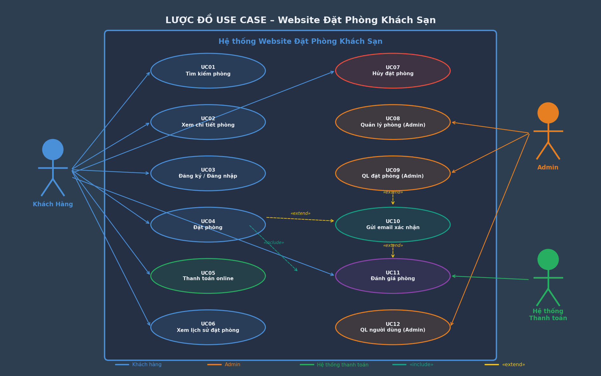
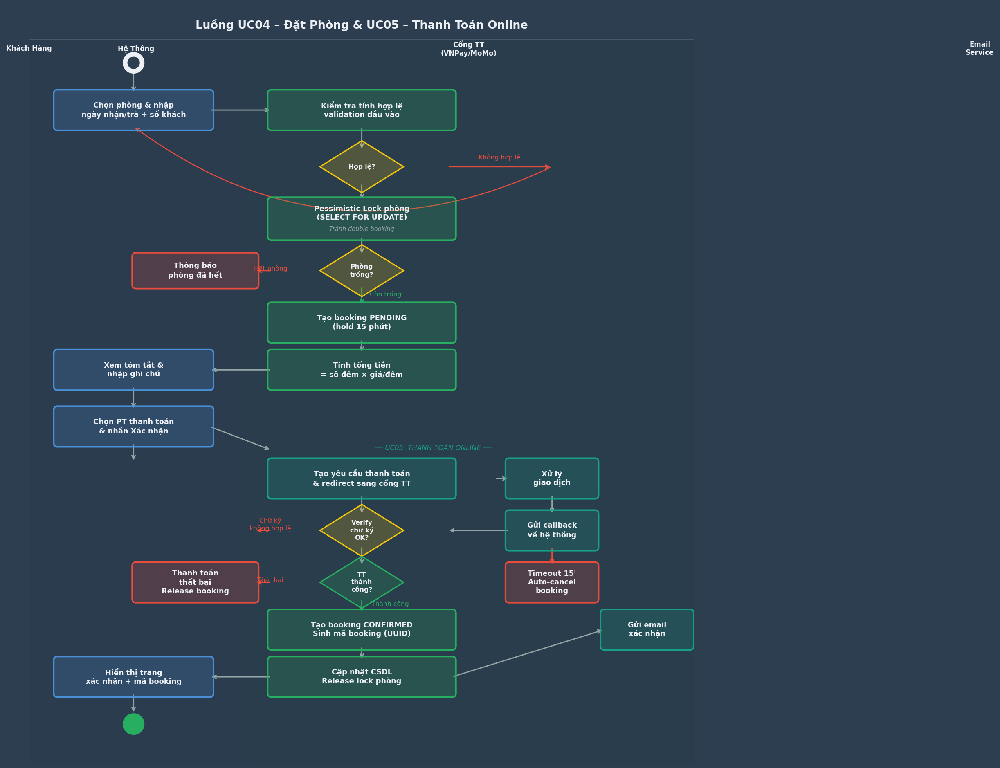
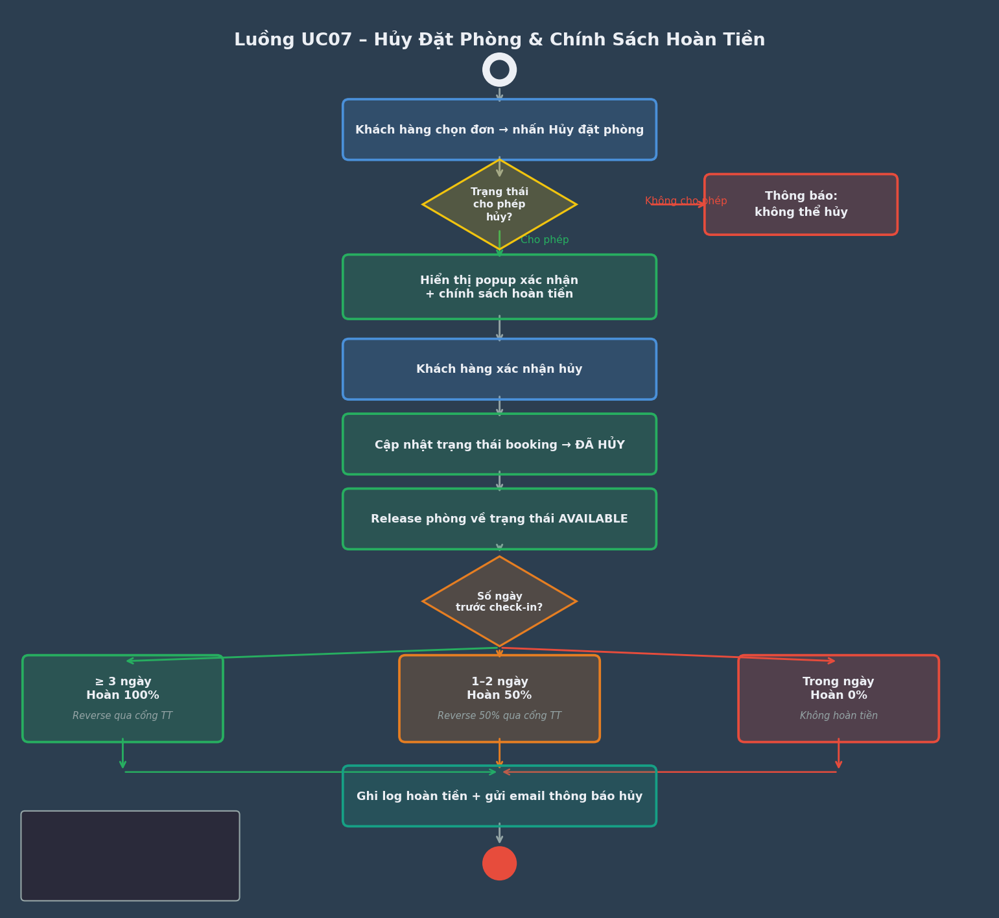
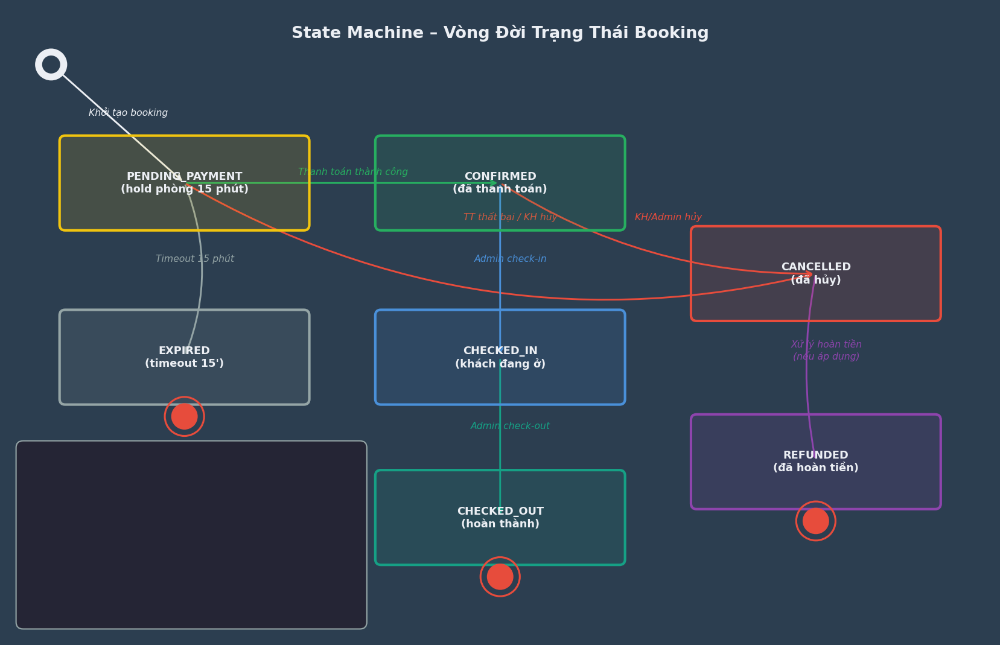
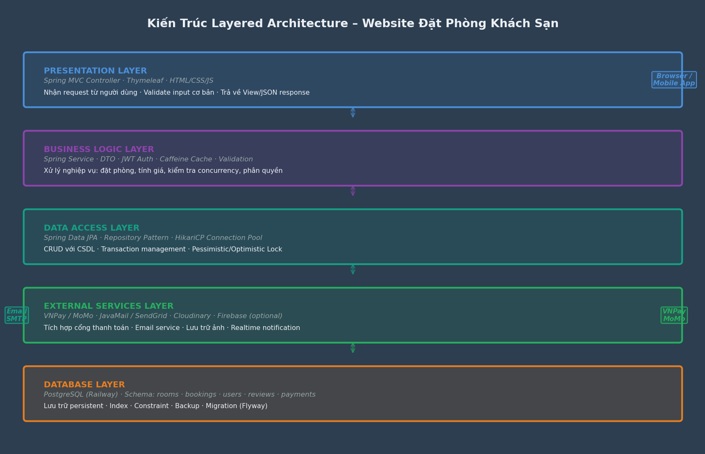
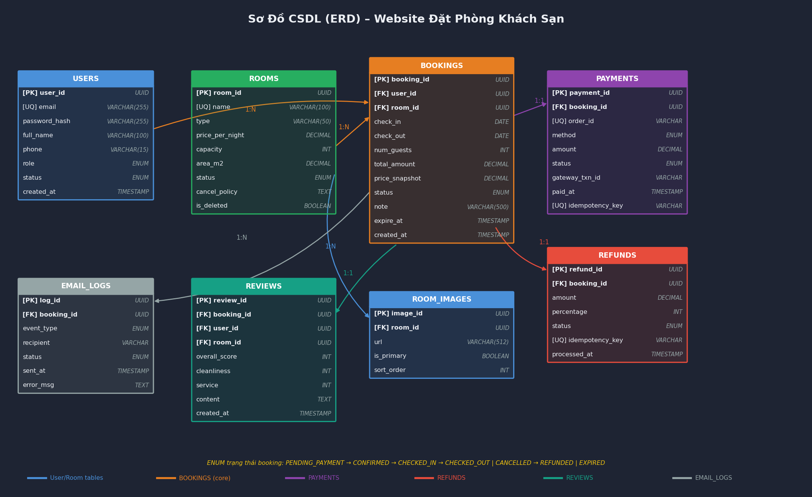
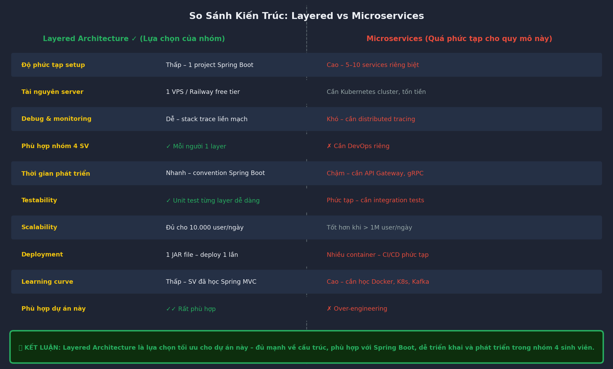

**HỌC VIỆN CÔNG NGHỆ BƯU CHÍNH VIỄN THÔNG**

**KHOA CÔNG NGHỆ THÔNG TIN 1**

──────────────────────────────────────────

**BÁO CÁO KIỂM TRA GIỮA KỲ**

**MÔN: NHẬP MÔN CÔNG NGHỆ PHẦN MỀM**

**ĐỀ TÀI:**

**WEBSITE ĐẶT PHÒNG KHÁCH SẠN**

|                    |                                   |
|--------------------|-----------------------------------|
| **Nhóm thực hiện** | Nhóm 9                            |
| **Lớp**            | E23CQNCN01                        |
| **Thành viên**     | Dương Ngọc Phú – N23DCDK055       |
|                    | Vũ Văn Kiên – N23DCDT029          |
|                    | Nguyễn Lê Minh Phúc – N23DCDK058  |
|                    | Lê Hoàng Nguyên Quân – N23DCDT041 |

Hà Nội, 2025

**PHẦN 1: LƯỢC ĐỒ USE CASE**

Hệ thống Website đặt phòng khách sạn bao gồm các tác nhân chính: Khách hàng (người dùng cuối), Admin (quản trị viên) và Hệ thống thanh toán (bên thứ ba). Dưới đây là mô tả chi tiết 12 use case bao phủ toàn bộ vòng đời nghiệp vụ của hệ thống.

Hình 1: Lược đồ Use Case tổng quan – Website Đặt Phòng Khách Sạn

**UC01 – Tìm Kiếm Phòng**

**Thông tin chung**

|                          |                                                                                                                              |
|--------------------------|------------------------------------------------------------------------------------------------------------------------------|
| **Tác nhân chính**       | Khách hàng                                                                                                                   |
| **Mục tiêu**             | Tìm kiếm phòng khách sạn còn trống theo tiêu chí: địa điểm / tên khách sạn, ngày nhận phòng, ngày trả phòng, số lượng khách. |
| **Điều kiện tiên quyết** | Khách hàng truy cập vào website (không cần đăng nhập).                                                                       |
| **Kết quả mong đợi**     | Hệ thống hiển thị danh sách phòng phù hợp với tiêu chí tìm kiếm, có thể lọc và sắp xếp kết quả.                              |
| **Quan hệ**              | —                                                                                                                            |

**Luồng sự kiện chính**

| **STT** | **Tác nhân** | **Hành động / Mô tả**                                                                                                                                                                                         |
|---------|--------------|---------------------------------------------------------------------------------------------------------------------------------------------------------------------------------------------------------------|
| 1       | Khách hàng   | Nhập tiêu chí tìm kiếm: địa điểm / tên khách sạn, ngày nhận phòng, ngày trả phòng, số lượng khách.                                                                                                            |
| 2       | Hệ thống     | Validate đầu vào: (a) ngày nhận phòng \>= hôm nay; (b) ngày trả phòng \> ngày nhận phòng; (c) 1 \<= số khách \<= 10; (d) khoảng lưu trú \<= 30 đêm. Nếu lỗi, hiển thị thông báo chi tiết và yêu cầu nhập lại. |
| 3       | Hệ thống     | Thực hiện truy vấn CSDL (fuzzy search cho địa điểm/tên), lọc các phòng có trạng thái AVAILABLE và không có booking CONFIRMED/PENDING_PAYMENT nào chồng khoảng \[check_in, check_out).                         |
| 4       | Hệ thống     | Trả về danh sách kết quả gồm: tên phòng, ảnh đại diện, giá/đêm, tiện nghi nổi bật, số sao đánh giá trung bình, số lượt đánh giá. Mặc định sắp xếp theo đánh giá giảm dần.                                     |
| 5       | Khách hàng   | Tùy chọn: lọc theo khoảng giá, loại phòng, tiện nghi; sắp xếp theo giá tăng/giảm, đánh giá, mới nhất.                                                                                                         |
| 6       | Hệ thống     | Trả về kết quả đã lọc/sắp xếp với phân trang (20 phòng/trang). Hiển thị tổng số kết quả tìm thấy.                                                                                                             |

**Luồng sự kiện thay thế / ngoại lệ**

| **STT** | **Tác nhân** | **Luồng thay thế / ngoại lệ**                                                                                                                 |
|---------|--------------|-----------------------------------------------------------------------------------------------------------------------------------------------|
| 2a      | Hệ thống     | Ngày nhận phòng \< hôm nay: hiển thị lỗi 'Ngày nhận phòng không hợp lệ, vui lòng chọn từ hôm nay trở đi'.                                     |
| 2b      | Hệ thống     | Số khách vượt giới hạn (\>10 hoặc \<=0): hiển thị lỗi 'Số lượng khách phải từ 1 đến 10 người'.                                                |
| 2c      | Hệ thống     | Khoảng lưu trú \> 30 đêm: hiển thị lỗi 'Thời gian lưu trú tối đa 30 đêm. Vui lòng liên hệ trực tiếp cho đặt phòng dài hạn'.                   |
| 4a      | Hệ thống     | Không tìm thấy phòng phù hợp: hiển thị thông báo 'Không có phòng trống trong khoảng thời gian này' và gợi ý thay đổi ngày hoặc giảm số khách. |
| 4b      | Hệ thống     | Lỗi kết nối CSDL: hiển thị thông báo lỗi hệ thống, ghi log, tự động retry 1 lần.                                                              |

**UC02 – Xem Chi Tiết Phòng**

**Thông tin chung**

|                          |                                                                              |
|--------------------------|------------------------------------------------------------------------------|
| **Tác nhân chính**       | Khách hàng                                                                   |
| **Mục tiêu**             | Xem đầy đủ thông tin chi tiết một phòng để ra quyết định đặt.                |
| **Điều kiện tiên quyết** | Khách hàng đã xem kết quả tìm kiếm (UC01) hoặc truy cập trực tiếp URL phòng. |
| **Kết quả mong đợi**     | Hiển thị đầy đủ thông tin phòng giúp khách hàng ra quyết định đặt phòng.     |

**Luồng sự kiện chính**

| **STT** | **Tác nhân** | **Hành động / Mô tả**                                                                                                                                                                                           |
|---------|--------------|-----------------------------------------------------------------------------------------------------------------------------------------------------------------------------------------------------------------|
| 1       | Khách hàng   | Nhấp vào một phòng trong danh sách kết quả tìm kiếm hoặc trang chủ.                                                                                                                                             |
| 2       | Hệ thống     | Tải và hiển thị thông tin chi tiết: gallery ảnh (slideshow), mô tả đầy đủ, danh sách tiện nghi, sức chứa tối đa, diện tích, chính sách hủy (có thể hủy/không hoàn tiền/...), bản đồ vị trí (Google Maps embed). |
| 3       | Hệ thống     | Hiển thị lịch khả dụng (availability calendar): các ngày đã đặt được tô màu đỏ, ngày còn trống màu xanh. Giá có thể thay đổi theo ngày (weekend pricing).                                                       |
| 4       | Hệ thống     | Hiển thị danh sách đánh giá từ khách hàng đã ở: điểm sao, nội dung nhận xét, ngày đánh giá. Phân trang 5 đánh giá/lần. Hiển thị điểm trung bình theo từng tiêu chí (vệ sinh, phục vụ, vị trí, giá trị).         |
| 5       | Khách hàng   | Quyết định: nhấn 'Đặt ngay' để chuyển sang UC04, hoặc quay lại danh sách.                                                                                                                                       |

**Luồng sự kiện thay thế / ngoại lệ**

| **STT** | **Tác nhân** | **Luồng thay thế / ngoại lệ**                                                                                            |
|---------|--------------|--------------------------------------------------------------------------------------------------------------------------|
| 2a      | Hệ thống     | Phòng không tồn tại (đã xóa hoặc ID không hợp lệ): hiển thị trang 404 với gợi ý quay lại tìm kiếm.                       |
| 2b      | Hệ thống     | Phòng đang ở trạng thái MAINTENANCE (bảo trì): hiển thị thông báo 'Phòng tạm thời không nhận đặt, vui lòng thử lại sau'. |

**UC03 – Đăng Ký / Đăng Nhập**

**Thông tin chung**

|                          |                                                                                                                         |
|--------------------------|-------------------------------------------------------------------------------------------------------------------------|
| **Tác nhân chính**       | Khách hàng                                                                                                              |
| **Mục tiêu**             | Xác thực danh tính người dùng để sử dụng các chức năng yêu cầu đăng nhập (đặt phòng, xem lịch sử, đánh giá, hủy phòng). |
| **Điều kiện tiên quyết** | Khách hàng chưa đăng nhập vào hệ thống.                                                                                 |
| **Kết quả mong đợi**     | Khách hàng đăng nhập thành công, nhận JWT token, được chuyển hướng về trang trước đó (redirect_uri).                    |

**Luồng sự kiện – Đăng nhập**

| **STT** | **Tác nhân** | **Hành động / Mô tả**                                                                                                                                                                                           |
|---------|--------------|-----------------------------------------------------------------------------------------------------------------------------------------------------------------------------------------------------------------|
| 1       | Khách hàng   | Nhập email và mật khẩu vào form đăng nhập. Hệ thống hiển thị CAPTCHA sau 3 lần thất bại liên tiếp.                                                                                                              |
| 2       | Hệ thống     | Kiểm tra email tồn tại trong CSDL và tài khoản ở trạng thái ACTIVE (đã xác minh email). Nếu email không tồn tại: hiển thị lỗi 'Email hoặc mật khẩu không chính xác' (không tiết lộ email có tồn tại hay không). |
| 3       | Hệ thống     | Xác thực mật khẩu bằng BCrypt (work factor \>= 12). Nếu sai: tăng bộ đếm thất bại; sau 5 lần sai liên tiếp trong 15 phút, khóa tài khoản tạm thời 15 phút.                                                      |
| 4       | Hệ thống     | Tạo JWT Access Token (TTL: 1 giờ) và Refresh Token (TTL: 7 ngày). Lưu Refresh Token vào HttpOnly Cookie. Ghi log đăng nhập thành công (IP, user agent, timestamp).                                              |
| 5       | Hệ thống     | Chuyển hướng về redirect_uri nếu có, hoặc về trang chủ.                                                                                                                                                         |

**Luồng sự kiện – Đăng ký**

| **STT** | **Tác nhân** | **Hành động / Mô tả**                                                                                                                                                                                       |
|---------|--------------|-------------------------------------------------------------------------------------------------------------------------------------------------------------------------------------------------------------|
| 1       | Khách hàng   | Điền thông tin: họ tên (2–100 ký tự), email, số điện thoại (10–11 số, Việt Nam), mật khẩu, xác nhận mật khẩu.                                                                                               |
| 2       | Hệ thống     | Validate: (a) email đúng định dạng và chưa được đăng ký; (b) mật khẩu \>= 8 ký tự, có ít nhất 1 chữ hoa, 1 chữ số, 1 ký tự đặc biệt; (c) xác nhận mật khẩu khớp; (d) số điện thoại đúng định dạng Việt Nam. |
| 3       | Hệ thống     | Mã hóa mật khẩu bằng BCrypt (work factor 12). Tạo tài khoản với trạng thái PENDING_VERIFICATION. Sinh token xác minh email (UUID, TTL: 24 giờ).                                                             |
| 4       | Hệ thống     | Gửi email xác minh tài khoản qua UC10. Hiển thị trang thông báo 'Vui lòng kiểm tra email để xác minh tài khoản'.                                                                                            |
| 5       | Khách hàng   | Nhấp vào link trong email xác minh. Hệ thống đổi trạng thái tài khoản sang ACTIVE. Tự động đăng nhập và chuyển hướng về trang chủ.                                                                          |

**Luồng sự kiện thay thế / ngoại lệ**

| **STT**        | **Tác nhân** | **Luồng thay thế / ngoại lệ**                                                                                                                        |
|----------------|--------------|------------------------------------------------------------------------------------------------------------------------------------------------------|
| 2a (đăng ký)   | Hệ thống     | Email đã tồn tại nhưng chưa xác minh: hệ thống gửi lại email xác minh và hiển thị 'Email đã đăng ký nhưng chưa xác minh. Đã gửi lại email xác minh'. |
| 2b (đăng ký)   | Hệ thống     | Mật khẩu không đủ mạnh: hiển thị cụ thể thiếu điều kiện nào (vd: 'Cần thêm ít nhất 1 ký tự đặc biệt').                                               |
| 5a (đăng ký)   | Hệ thống     | Link xác minh hết hạn (\>24 giờ): hiển thị trang 'Link đã hết hạn' với nút 'Gửi lại email xác minh'.                                                 |
| 3a (đăng nhập) | Hệ thống     | Tài khoản PENDING_VERIFICATION: hiển thị 'Tài khoản chưa xác minh email. Nhấn đây để gửi lại email xác minh'.                                        |
| 3b (đăng nhập) | Hệ thống     | Tài khoản bị khóa (LOCKED): hiển thị 'Tài khoản bị tạm khóa do đăng nhập sai nhiều lần. Thử lại sau X phút'.                                         |

**UC04 – Đặt Phòng**

**Thông tin chung**

|                          |                                                                                                                                                                                              |
|--------------------------|----------------------------------------------------------------------------------------------------------------------------------------------------------------------------------------------|
| **Tác nhân chính**       | Khách hàng (đã đăng nhập)                                                                                                                                                                    |
| **Mục tiêu**             | Đặt một phòng khách sạn trong khoảng thời gian mong muốn, xử lý đồng thời (concurrency) để tránh double booking.                                                                             |
| **Điều kiện tiên quyết** | Khách hàng đã đăng nhập (JWT hợp lệ). Phòng còn trống. Hệ thống thanh toán hoạt động.                                                                                                        |
| **Kết quả mong đợi**     | Booking được tạo với trạng thái CONFIRMED, mã booking (UUID) được sinh, email xác nhận được gửi trong 60 giây.                                                                               |
| **Include**              | UC05 – Thanh toán online                                                                                                                                                                     |
| **Extend**               | UC10 – Gửi email xác nhận                                                                                                                                                                    |
| **Business rule**        | Tổng tiền = số đêm × giá/đêm (theo giá tại thời điểm tạo booking). Phòng bị hold PENDING_PAYMENT trong 15 phút. Sau 15 phút chưa thanh toán, booking tự động EXPIRED, phòng được giải phóng. |

⚠ Lưu ý quan trọng về Concurrency: Hệ thống sử dụng Pessimistic Lock (SELECT ... FOR UPDATE) tại bước kiểm tra phòng trống để tránh race condition khi nhiều khách cùng đặt một phòng.

**Luồng sự kiện chính**

| **STT** | **Tác nhân** | **Hành động / Mô tả**                                                                                                                                                                                                                                                                                                |
|---------|--------------|----------------------------------------------------------------------------------------------------------------------------------------------------------------------------------------------------------------------------------------------------------------------------------------------------------------------|
| 1       | Khách hàng   | Chọn phòng, xác nhận ngày nhận phòng, ngày trả phòng, số lượng khách. Nhấn 'Đặt ngay'.                                                                                                                                                                                                                               |
| 2       | Hệ thống     | Kiểm tra JWT còn hạn. Nếu hết hạn: redirect sang UC03 (đăng nhập) với redirect_uri về trang đặt phòng.                                                                                                                                                                                                               |
| 3       | Hệ thống     | Thực hiện Pessimistic Lock (transaction): SELECT phòng FOR UPDATE, kiểm tra không tồn tại booking CONFIRMED hoặc PENDING_PAYMENT nào chồng khoảng \[check_in, check_out). Nếu phòng còn trống: tạo booking tạm trạng thái PENDING_PAYMENT, ghi timestamp_expire = NOW() + 15 phút. Commit transaction, release lock. |
| 4       | Hệ thống     | Tính tổng tiền = số đêm × giá phòng tại thời điểm tạo booking (snapshot giá). Hiển thị form xác nhận: thông tin phòng, ngày, tổng tiền, chính sách hủy.                                                                                                                                                              |
| 5       | Khách hàng   | Kiểm tra thông tin, nhập ghi chú đặc biệt (nếu có, tối đa 500 ký tự), chọn phương thức thanh toán, nhấn 'Xác nhận và thanh toán'.                                                                                                                                                                                    |
| 6       | Hệ thống     | Kiểm tra booking PENDING_PAYMENT còn trong thời hạn (\< 15 phút). Thực hiện UC05 – Thanh toán online.                                                                                                                                                                                                                |
| 7       | Hệ thống     | Sau thanh toán thành công: cập nhật booking sang CONFIRMED, sinh mã booking (UUID v4), ghi lại snapshot giá và thông tin thanh toán vào bảng payments.                                                                                                                                                               |
| 8       | Hệ thống     | Thực hiện UC10 – Gửi email xác nhận. Hiển thị trang xác nhận đặt phòng thành công với mã booking và thông tin chi tiết.                                                                                                                                                                                              |

**Luồng sự kiện thay thế / ngoại lệ**

| **STT** | **Tác nhân** | **Luồng thay thế / ngoại lệ**                                                                                                                                                                            |
|---------|--------------|----------------------------------------------------------------------------------------------------------------------------------------------------------------------------------------------------------|
| 3a      | Hệ thống     | Phòng đã có booking chồng lên trong khoảng thời gian đó: hiển thị thông báo 'Rất tiếc, phòng vừa được đặt bởi người khác. Vui lòng chọn ngày khác hoặc phòng khác.' Gợi ý các phòng tương tự còn trống.  |
| 6a      | Hệ thống     | Booking PENDING_PAYMENT đã EXPIRED (quá 15 phút): hiển thị 'Phiên đặt phòng đã hết hạn. Vui lòng thực hiện lại.' Redirect về trang chi tiết phòng.                                                       |
| 7a      | Hệ thống     | Thanh toán thất bại: booking vẫn ở PENDING_PAYMENT, hiển thị thông báo lỗi thanh toán với tùy chọn thử lại. Booking tự hủy sau 15 phút nếu không retry thành công.                                       |
| 7b      | Hệ thống     | Lỗi ghi CSDL sau thanh toán thành công: hệ thống ghi log CRITICAL, trigger alert cho admin. Thực hiện reconciliation với cổng thanh toán để đảm bảo tính nhất quán. Gửi email thủ công xác nhận booking. |

Hình 2: Luồng hoạt động UC04 – Đặt Phòng & UC05 – Thanh Toán Online (bao gồm Pessimistic Lock)

**UC05 – Thanh Toán Online**

**Thông tin chung**

|                          |                                                                                                                                                  |
|--------------------------|--------------------------------------------------------------------------------------------------------------------------------------------------|
| **Tác nhân chính**       | Khách hàng, Hệ thống thanh toán (VNPay / MoMo)                                                                                                   |
| **Mục tiêu**             | Xử lý thanh toán cho đơn đặt phòng qua cổng thanh toán trực tuyến một cách an toàn và đáng tin cậy.                                              |
| **Điều kiện tiên quyết** | Booking ở trạng thái PENDING_PAYMENT và chưa EXPIRED. Khách hàng đã chọn phương thức thanh toán.                                                 |
| **Kết quả mong đợi**     | Giao dịch thanh toán thành công, hệ thống nhận và xác minh callback, trạng thái payment được cập nhật.                                           |
| **Business rule**        | Mỗi giao dịch có mã order_id duy nhất. Xử lý idempotent: cùng 1 callback không được xử lý 2 lần. Timeout thanh toán: 15 phút kể từ lúc redirect. |

**Luồng sự kiện chính**

| **STT** | **Tác nhân** | **Hành động / Mô tả**                                                                                                                                                                                 |
|---------|--------------|-------------------------------------------------------------------------------------------------------------------------------------------------------------------------------------------------------|
| 1       | Hệ thống     | Tạo yêu cầu thanh toán: sinh order_id (UUID), amount, return_url, ipn_url. Tính checksum/chữ ký theo đặc tả của VNPay/MoMo. Lưu payment_request vào CSDL với trạng thái INITIATED.                    |
| 2       | Hệ thống     | Redirect khách hàng sang trang thanh toán của cổng thanh toán kèm các tham số đã ký.                                                                                                                  |
| 3       | Khách hàng   | Nhập thông tin thanh toán (số thẻ/tài khoản/OTP) và xác nhận thanh toán trên trang của cổng thanh toán.                                                                                               |
| 4       | Hệ thống TT  | Xử lý giao dịch. Gửi IPN callback (server-to-server) kết quả về ipn_url của hệ thống. Redirect khách hàng về return_url.                                                                              |
| 5       | Hệ thống     | Nhận IPN callback: xác minh chữ ký HMAC, kiểm tra idempotency (order_id chưa được xử lý), cập nhật trạng thái payment sang SUCCESS/FAILED. Trả về response 200 cho cổng thanh toán trong vòng 3 giây. |
| 6       | Hệ thống     | Nhận return_url redirect: kiểm tra lại trạng thái payment trong CSDL (không tin tưởng query params từ return_url). Hiển thị kết quả thanh toán tương ứng.                                             |

**Luồng sự kiện thay thế / ngoại lệ**

| **STT** | **Tác nhân** | **Luồng thay thế / ngoại lệ**                                                                                                                                        |
|---------|--------------|----------------------------------------------------------------------------------------------------------------------------------------------------------------------|
| 4a      | Hệ thống TT  | IPN callback không đến (mất kết nối mạng): hệ thống có background job chạy mỗi 5 phút, chủ động query API VNPay/MoMo để reconcile các payment INITIATED quá 10 phút. |
| 5a      | Hệ thống     | Chữ ký HMAC không hợp lệ: từ chối callback, ghi log WARNING, không cập nhật trạng thái. Ngăn chặn tấn công giả mạo callback.                                         |
| 5b      | Hệ thống     | order_id đã được xử lý (duplicate callback): trả về 200 OK nhưng không xử lý lại (idempotent handler). Tránh duplicate refund/confirm.                               |
| Timeout | Hệ thống     | Payment INITIATED quá 15 phút: background job tự động cập nhật sang TIMEOUT, booking tương ứng sang EXPIRED. Phòng được giải phóng.                                  |

**UC06 – Xem Lịch Sử Đặt Phòng**

**Thông tin chung**

|                          |                                                                                                   |
|--------------------------|---------------------------------------------------------------------------------------------------|
| **Tác nhân chính**       | Khách hàng (đã đăng nhập)                                                                         |
| **Mục tiêu**             | Xem toàn bộ lịch sử đặt phòng của bản thân, lọc và theo dõi trạng thái từng đơn.                  |
| **Điều kiện tiên quyết** | Khách hàng đã đăng nhập.                                                                          |
| **Kết quả mong đợi**     | Hiển thị danh sách đặt phòng có phân trang, lọc theo trạng thái, kèm thông tin chi tiết từng đơn. |

**Luồng sự kiện chính**

| **STT** | **Tác nhân** | **Hành động / Mô tả**                                                                                                                                                                                               |
|---------|--------------|---------------------------------------------------------------------------------------------------------------------------------------------------------------------------------------------------------------------|
| 1       | Khách hàng   | Truy cập mục 'Lịch sử đặt phòng' trong tài khoản cá nhân.                                                                                                                                                           |
| 2       | Hệ thống     | Truy vấn CSDL lấy booking của tài khoản hiện tại (lọc theo user_id từ JWT, tránh IDOR). Sắp xếp theo created_at giảm dần. Phân trang: 10 booking/trang.                                                             |
| 3       | Hệ thống     | Hiển thị danh sách: mã booking, tên phòng, ngày nhận/trả phòng, tổng tiền, trạng thái (badge màu: PENDING_PAYMENT=vàng / CONFIRMED=xanh / CHECKED_IN=xanh đậm / CHECKED_OUT=xám / CANCELLED=đỏ / EXPIRED=xám nhạt). |
| 4       | Khách hàng   | Tùy chọn lọc theo trạng thái, khoảng thời gian. Nhấp vào một đơn để xem chi tiết hoặc thực hiện hành động (hủy nếu đủ điều kiện, đánh giá nếu CHECKED_OUT).                                                         |

**Luồng sự kiện thay thế / ngoại lệ**

| **STT** | **Tác nhân** | **Luồng thay thế / ngoại lệ**                                                 |
|---------|--------------|-------------------------------------------------------------------------------|
| 2a      | Hệ thống     | Không có booking nào: hiển thị màn hình empty state với CTA 'Đặt phòng ngay'. |
| 2b      | Hệ thống     | JWT hết hạn: redirect sang đăng nhập với redirect_uri về trang lịch sử.       |

**UC07 – Hủy Đặt Phòng**

**Thông tin chung**

|                          |                                                                                                                                                                                    |
|--------------------------|------------------------------------------------------------------------------------------------------------------------------------------------------------------------------------|
| **Tác nhân chính**       | Khách hàng (đã đăng nhập)                                                                                                                                                          |
| **Mục tiêu**             | Hủy một đơn đặt phòng đã CONFIRMED, xử lý hoàn tiền theo chính sách, giải phóng phòng để nhận đặt mới.                                                                             |
| **Điều kiện tiên quyết** | Khách hàng đã đăng nhập. Booking ở trạng thái CONFIRMED (không phải CHECKED_IN, CANCELLED, CHECKED_OUT, EXPIRED).                                                                  |
| **Kết quả mong đợi**     | Booking cập nhật trạng thái CANCELLED. Hoàn tiền theo chính sách. Phòng trở về AVAILABLE. Email thông báo được gửi.                                                                |
| **Chính sách hoàn tiền** | Hủy \>= 3 ngày trước check-in: hoàn 100%. Hủy 1–2 ngày trước check-in: hoàn 50%. Hủy trong ngày check-in: hoàn 0%. Thời gian hoàn tiền: 5–7 ngày làm việc qua cổng thanh toán gốc. |

**Luồng sự kiện chính**

| **STT** | **Tác nhân** | **Hành động / Mô tả**                                                                                                                                                        |
|---------|--------------|------------------------------------------------------------------------------------------------------------------------------------------------------------------------------|
| 1       | Khách hàng   | Vào lịch sử đặt phòng, chọn đơn CONFIRMED muốn hủy, nhấn 'Hủy đặt phòng'.                                                                                                    |
| 2       | Hệ thống     | Kiểm tra điều kiện: (a) booking thuộc về khách hàng đang đăng nhập (chống IDOR); (b) trạng thái là CONFIRMED; (c) ngày check-in \> hôm nay (không hủy được nếu đã check-in). |
| 3       | Hệ thống     | Tính số ngày còn lại đến check-in. Xác định tỷ lệ hoàn tiền theo chính sách. Tính số tiền được hoàn = tổng tiền × tỷ lệ hoàn.                                                |
| 4       | Hệ thống     | Hiển thị modal xác nhận: thông tin đơn, số tiền được hoàn, thời gian hoàn tiền dự kiến, cảnh báo 'Hành động này không thể hoàn tác'.                                         |
| 5       | Khách hàng   | Xác nhận hủy.                                                                                                                                                                |
| 6       | Hệ thống     | Cập nhật booking sang CANCELLED trong transaction. Giải phóng phòng về AVAILABLE. Tạo refund_request với trạng thái PENDING (idempotency key = booking_id).                  |
| 7       | Hệ thống     | Nếu số tiền hoàn \> 0: gọi API hoàn tiền của cổng thanh toán gốc. Cập nhật refund_request sang PROCESSING. Background job theo dõi kết quả hoàn tiền.                        |
| 8       | Hệ thống     | Gửi email thông báo hủy kèm thông tin hoàn tiền qua UC10. Hiển thị trang xác nhận hủy thành công.                                                                            |

**Luồng sự kiện thay thế / ngoại lệ**

| **STT** | **Tác nhân** | **Luồng thay thế / ngoại lệ**                                                                                                              |
|---------|--------------|--------------------------------------------------------------------------------------------------------------------------------------------|
| 2a      | Hệ thống     | Booking không ở trạng thái CONFIRMED (ví dụ: đã CANCELLED): hiển thị lỗi 'Đơn này không thể hủy'.                                          |
| 2b      | Hệ thống     | Ngày check-in là hôm nay và đã qua giờ check-in (\>= 14:00): hiển thị 'Không thể hủy sau giờ check-in. Vui lòng liên hệ lễ tân khách sạn'. |
| 7a      | Hệ thống     | API hoàn tiền thất bại: refund_request sang FAILED, ghi log CRITICAL, gửi alert admin. Admin xử lý hoàn tiền thủ công.                     |
| 7b      | Hệ thống     | Duplicate cancel request (nhấn 2 lần): idempotency key ngăn tạo 2 refund_request, trả về kết quả lần đầu.                                  |

Hình 3: Luồng UC07 – Hủy Đặt Phòng & Chính Sách Hoàn Tiền

**UC08 – Quản Lý Phòng (Admin)**

**Thông tin chung**

|                           |                                                                                                                                                                                     |
|---------------------------|-------------------------------------------------------------------------------------------------------------------------------------------------------------------------------------|
| **Tác nhân chính**        | Admin                                                                                                                                                                               |
| **Mục tiêu**              | Quản lý danh sách phòng: thêm mới, chỉnh sửa thông tin, thay đổi trạng thái, xóa phòng.                                                                                             |
| **Điều kiện tiên quyết**  | Admin đã đăng nhập với role ADMIN (kiểm tra qua JWT + Spring Security).                                                                                                             |
| **Kết quả mong đợi**      | Thông tin phòng được cập nhật chính xác trong CSDL, thay đổi được phản ánh ngay trên giao diện khách hàng.                                                                          |
| **Validation thêm phòng** | Tên phòng: 2–100 ký tự, không trùng trong cùng khách sạn. Giá/đêm: \> 0, tối đa 100.000.000 VND. Sức chứa: 1–10 người. Ảnh: tối đa 10 ảnh, mỗi ảnh \<= 5MB, định dạng JPG/PNG/WebP. |

**Luồng sự kiện chính**

| **STT** | **Tác nhân** | **Hành động / Mô tả**                                                                                                                                                                                                                |
|---------|--------------|--------------------------------------------------------------------------------------------------------------------------------------------------------------------------------------------------------------------------------------|
| 1       | Admin        | Truy cập trang quản trị (Dashboard), chọn mục 'Quản lý phòng'.                                                                                                                                                                       |
| 2       | Hệ thống     | Hiển thị danh sách tất cả phòng với bộ lọc theo loại phòng, trạng thái, khoảng giá. Có phân trang 20 phòng/trang.                                                                                                                    |
| 3       | Admin        | Thêm phòng mới: điền form (tên, loại, giá/đêm, sức chứa, diện tích, tiện nghi, chính sách hủy, mô tả, ảnh). Submit.                                                                                                                  |
| 4       | Hệ thống     | Validate đầu vào theo business rule. Upload ảnh lên Cloudinary, lưu URL. Tạo record phòng mới với trạng thái AVAILABLE.                                                                                                              |
| 5       | Admin        | Chỉnh sửa phòng: chọn phòng, sửa thông tin. Lưu ý: thay đổi giá chỉ áp dụng cho booking MỚI, không ảnh hưởng booking đã CONFIRMED (snapshot giá).                                                                                    |
| 6       | Hệ thống     | Kiểm tra phòng tồn tại. Cập nhật thông tin. Invalidate cache phòng. Ghi audit log (ai sửa, sửa gì, lúc nào).                                                                                                                         |
| 7       | Admin        | Thay đổi trạng thái phòng: AVAILABLE ↔ MAINTENANCE. Phòng MAINTENANCE không nhận đặt phòng mới.                                                                                                                                      |
| 8       | Hệ thống     | Nếu chuyển sang MAINTENANCE mà có booking CONFIRMED trong tương lai: hiển thị danh sách booking bị ảnh hưởng, yêu cầu Admin xác nhận và thông báo khách hàng trước khi đổi trạng thái.                                               |
| 9       | Admin        | Xóa phòng: chọn phòng, nhấn 'Xóa'.                                                                                                                                                                                                   |
| 10      | Hệ thống     | Kiểm tra không có booking CONFIRMED hoặc PENDING_PAYMENT nào đang hoạt động. Nếu có: từ chối xóa, hiển thị danh sách booking cần xử lý trước. Nếu không: soft delete (đánh dấu is_deleted=true, không xóa thật để bảo toàn lịch sử). |

**Luồng sự kiện thay thế / ngoại lệ**

| **STT** | **Tác nhân** | **Luồng thay thế / ngoại lệ**                                                                                           |
|---------|--------------|-------------------------------------------------------------------------------------------------------------------------|
| 4a      | Hệ thống     | Tên phòng trùng trong cùng khách sạn: hiển thị lỗi 'Tên phòng đã tồn tại trong khách sạn này'.                          |
| 4b      | Hệ thống     | Upload ảnh thất bại (lỗi Cloudinary): hiển thị thông báo lỗi, không lưu record phòng. Cho phép retry upload.            |
| 10a     | Hệ thống     | Phòng có booking đang hoạt động: 'Không thể xóa phòng đang có đặt phòng. Cần hủy hoặc hoàn thành tất cả booking trước.' |

**UC09 – Quản Lý Đặt Phòng (Admin)**

**Thông tin chung**

|                          |                                                                                                                            |
|--------------------------|----------------------------------------------------------------------------------------------------------------------------|
| **Tác nhân chính**       | Admin                                                                                                                      |
| **Mục tiêu**             | Xem, xác nhận, cập nhật trạng thái các đơn đặt phòng; đánh dấu check-in/check-out khi khách đến và rời khách sạn.          |
| **Điều kiện tiên quyết** | Admin đã đăng nhập với role ADMIN.                                                                                         |
| **Kết quả mong đợi**     | Trạng thái đơn đặt phòng được quản lý chính xác, kịp thời. Khách hàng được thông báo qua email khi có thay đổi trạng thái. |
| **State machine**        | CONFIRMED → CHECKED_IN (khi khách đến). CHECKED_IN → CHECKED_OUT (khi khách rời). Không thể đảo ngược.                     |

**Luồng sự kiện chính**

| **STT** | **Tác nhân** | **Hành động / Mô tả**                                                                                                                                                 |
|---------|--------------|-----------------------------------------------------------------------------------------------------------------------------------------------------------------------|
| 1       | Admin        | Vào mục 'Quản lý đặt phòng' trên Dashboard.                                                                                                                           |
| 2       | Hệ thống     | Hiển thị toàn bộ danh sách booking, lọc được theo: trạng thái, khoảng ngày check-in, tên khách, phòng, mã booking. Phân trang 20 đơn/trang.                           |
| 3       | Admin        | Chọn một booking để xem chi tiết: thông tin khách, phòng, ngày, tổng tiền, lịch sử thay đổi trạng thái, ghi chú.                                                      |
| 4       | Admin        | Đánh dấu check-in: chỉ áp dụng cho booking CONFIRMED có ngày check-in = hôm nay (± 1 ngày buffer). Chuyển trạng thái sang CHECKED_IN, ghi timestamp check-in thực tế. |
| 5       | Hệ thống     | Lưu trạng thái CHECKED_IN. Gửi email/notification 'Chào mừng quý khách đã check-in' qua UC10.                                                                         |
| 6       | Admin        | Đánh dấu check-out: chỉ áp dụng cho booking CHECKED_IN. Chuyển trạng thái sang CHECKED_OUT.                                                                           |
| 7       | Hệ thống     | Lưu CHECKED_OUT, ghi timestamp check-out thực tế. Phòng về AVAILABLE. Trigger UC11 (gửi yêu cầu đánh giá sau 2 giờ).                                                  |

**Luồng sự kiện thay thế / ngoại lệ**

| **STT** | **Tác nhân** | **Luồng thay thế / ngoại lệ**                                                                                                                                          |
|---------|--------------|------------------------------------------------------------------------------------------------------------------------------------------------------------------------|
| 4a      | Admin        | Cố gắng check-in booking ngày mai hoặc hôm qua: hệ thống cảnh báo 'Ngày check-in không phải hôm nay' và yêu cầu xác nhận nếu vẫn muốn tiến hành (early/late check-in). |
| 6a      | Admin        | Cố gắng check-out trước ngày check-out dự kiến: hệ thống cảnh báo và hỏi xác nhận. Ghi nhận early check-out để phục vụ báo cáo.                                        |
| Lỗi     | Hệ thống     | Lỗi cập nhật CSDL: ghi log ERROR, hiển thị thông báo lỗi cho Admin, không thay đổi trạng thái. Admin thử lại.                                                          |

Hình 4: State Machine – Vòng Đời Trạng Thái Booking

**UC10 – Gửi Email Thông Báo (Automated)**

**Thông tin chung**

|                          |                                                                                                        |
|--------------------------|--------------------------------------------------------------------------------------------------------|
| **Tác nhân chính**       | Hệ thống (tự động, async)                                                                              |
| **Mục tiêu**             | Gửi email thông báo tự động đến khách hàng khi có sự kiện quan trọng xảy ra trong hệ thống.            |
| **Điều kiện tiên quyết** | Có trigger từ các UC: đặt phòng thành công, hủy phòng, check-in, check-out, yêu cầu đánh giá.          |
| **Kết quả mong đợi**     | Email được gửi thành công trong vòng 60 giây sau trigger. Retry tối đa 3 lần nếu lỗi. Ghi log kết quả. |
| **Quan hệ**              | extend UC04, UC07, UC09, UC11                                                                          |

**Luồng sự kiện chính**

| **STT** | **Tác nhân** | **Hành động / Mô tả**                                                                                                                                         |
|---------|--------------|---------------------------------------------------------------------------------------------------------------------------------------------------------------|
| 1       | Hệ thống     | Nhận trigger (event): BOOKING_CONFIRMED / BOOKING_CANCELLED / CHECKED_IN / CHECKED_OUT / REVIEW_REQUEST. Đưa vào async email queue (không block luồng chính). |
| 2       | Hệ thống     | Worker lấy job từ queue: lấy thông tin đặt phòng (mã booking, tên khách, phòng, ngày, tổng tiền, chính sách hoàn tiền nếu hủy).                               |
| 3       | Hệ thống     | Render HTML template tương ứng với loại event. Template có responsive design, bao gồm: logo, thông tin đặt phòng dạng bảng, CTA button, thông tin liên hệ.    |
| 4       | Hệ thống     | Gửi email qua SMTP (ưu tiên) hoặc SendGrid API (fallback). Đặt Reply-To là email hỗ trợ khách sạn.                                                            |
| 5       | Hệ thống     | Ghi log kết quả: email_logs(booking_id, event_type, recipient, sent_at, status, error_message). Cập nhật trạng thái job trong queue.                          |

**Luồng sự kiện thay thế / ngoại lệ**

| **STT** | **Tác nhân** | **Luồng thay thế / ngoại lệ**                                                                                                                      |
|---------|--------------|----------------------------------------------------------------------------------------------------------------------------------------------------|
| 4a      | Hệ thống     | Gửi thất bại (SMTP timeout / network error): retry sau 5 phút, tối đa 3 lần. Nếu vẫn thất bại: ghi log FAILED, gửi alert nội bộ để xử lý thủ công. |
| 4b      | Hệ thống     | Email address không hợp lệ (bounce): ghi log BOUNCED, đánh dấu email của tài khoản là invalid, không retry (tránh spam).                           |
| 4c      | Hệ thống     | Email bị đánh dấu spam (complaint): ghi log COMPLAINED, tạm dừng gửi email cho địa chỉ này, thông báo admin.                                       |

**UC11 – Đánh Giá Phòng Sau Check-out**

**Thông tin chung**

|                          |                                                                                                                           |
|--------------------------|---------------------------------------------------------------------------------------------------------------------------|
| **Tác nhân chính**       | Khách hàng (đã đăng nhập)                                                                                                 |
| **Mục tiêu**             | Cho phép khách hàng đánh giá phòng sau khi hoàn thành lưu trú, cung cấp thông tin tham khảo cho khách hàng tương lai.     |
| **Điều kiện tiên quyết** | Khách hàng đã đăng nhập. Booking ở trạng thái CHECKED_OUT. Chưa có đánh giá nào cho booking này (1 booking = 1 đánh giá). |
| **Kết quả mong đợi**     | Đánh giá được lưu, điểm trung bình phòng được cập nhật, hiển thị trên trang chi tiết phòng.                               |

**Luồng sự kiện chính**

| **STT** | **Tác nhân** | **Hành động / Mô tả**                                                                                                                                                                                                                   |
|---------|--------------|-----------------------------------------------------------------------------------------------------------------------------------------------------------------------------------------------------------------------------------------|
| 1       | Hệ thống     | 2 giờ sau check-out (hoặc ngày hôm sau): gửi email mời đánh giá (UC10) với link trực tiếp đến trang đánh giá booking.                                                                                                                   |
| 2       | Khách hàng   | Truy cập trang đánh giá (từ email hoặc từ lịch sử đặt phòng). Nhập đánh giá: điểm sao tổng thể (1–5), điểm theo tiêu chí (vệ sinh / phục vụ / vị trí / giá trị), nội dung nhận xét (50–2000 ký tự), tùy chọn upload ảnh (tối đa 5 ảnh). |
| 3       | Hệ thống     | Validate: đánh giá thuộc booking của user đang đăng nhập, booking đã CHECKED_OUT, chưa có review. Kiểm tra nội dung không vi phạm (profanity filter).                                                                                   |
| 4       | Hệ thống     | Lưu review. Cập nhật điểm trung bình của phòng (aggregate function). Đánh dấu booking đã được đánh giá.                                                                                                                                 |
| 5       | Hệ thống     | Hiển thị thông báo 'Cảm ơn đánh giá của bạn!'. Review được hiển thị ngay trên trang phòng (hoặc sau khi admin duyệt nếu áp dụng moderation).                                                                                            |

**Luồng sự kiện thay thế / ngoại lệ**

| **STT** | **Tác nhân** | **Luồng thay thế / ngoại lệ**                                                                                                         |
|---------|--------------|---------------------------------------------------------------------------------------------------------------------------------------|
| 3a      | Hệ thống     | Booking chưa CHECKED_OUT: 'Chỉ có thể đánh giá sau khi hoàn thành lưu trú'.                                                           |
| 3b      | Hệ thống     | Đã có đánh giá rồi: 'Bạn đã đánh giá đặt phòng này. Mỗi đặt phòng chỉ được đánh giá một lần.' Có thể cho phép chỉnh sửa trong 24 giờ. |
| 3c      | Hệ thống     | Nội dung vi phạm (profanity filter): 'Nội dung không phù hợp. Vui lòng chỉnh sửa lại.'                                                |

**UC12 – Quản Lý Người Dùng (Admin)**

**Thông tin chung**

|                          |                                                                                  |
|--------------------------|----------------------------------------------------------------------------------|
| **Tác nhân chính**       | Admin                                                                            |
| **Mục tiêu**             | Quản lý danh sách tài khoản người dùng: xem thông tin, khóa/mở khóa, phân quyền. |
| **Điều kiện tiên quyết** | Admin đã đăng nhập với role ADMIN.                                               |
| **Kết quả mong đợi**     | Tài khoản người dùng được quản lý chính xác, đảm bảo an toàn hệ thống.           |

**Luồng sự kiện chính**

| **STT** | **Tác nhân** | **Hành động / Mô tả**                                                                                                                                                              |
|---------|--------------|------------------------------------------------------------------------------------------------------------------------------------------------------------------------------------|
| 1       | Admin        | Vào mục 'Quản lý người dùng' trên Dashboard.                                                                                                                                       |
| 2       | Hệ thống     | Hiển thị danh sách người dùng: tên, email, trạng thái (ACTIVE/LOCKED/PENDING), ngày đăng ký, số booking. Hỗ trợ tìm kiếm theo email/tên, lọc theo trạng thái. Phân trang 20/trang. |
| 3       | Admin        | Xem chi tiết tài khoản: thông tin cơ bản, lịch sử đặt phòng, lịch sử đăng nhập (IP, thời gian), đánh giá đã viết.                                                                  |
| 4       | Admin        | Khóa tài khoản: đổi trạng thái sang LOCKED, nhập lý do. Người dùng không thể đăng nhập. JWT hiện tại bị revoke (thêm vào blacklist).                                               |
| 5       | Admin        | Mở khóa tài khoản: đổi sang ACTIVE. Gửi email thông báo cho người dùng.                                                                                                            |
| 6       | Admin        | Phân quyền: chỉ SUPER_ADMIN mới có quyền nâng một user lên ADMIN. Audit log mọi thay đổi quyền.                                                                                    |

**Luồng sự kiện thay thế / ngoại lệ**

| **STT** | **Tác nhân** | **Luồng thay thế / ngoại lệ**                                                                                                                                    |
|---------|--------------|------------------------------------------------------------------------------------------------------------------------------------------------------------------|
| 4a      | Hệ thống     | Admin cố gắng khóa SUPER_ADMIN: 'Không được phép khóa tài khoản SUPER_ADMIN'.                                                                                    |
| 4b      | Hệ thống     | Người dùng đang có booking CONFIRMED: hiển thị cảnh báo danh sách booking, Admin xác nhận vẫn khóa thì tiến hành (booking vẫn giữ nguyên, Admin xử lý thủ công). |
| 6a      | Hệ thống     | Admin thường cố gắng phân quyền ADMIN cho user: 'Chỉ SUPER_ADMIN mới có quyền thực hiện thao tác này'.                                                           |

**PHẦN 2: ĐỀ XUẤT KIẾN TRÚC HỆ THỐNG**

**2.1. Kiến Trúc Đề Xuất: Layered Architecture (Kiến Trúc Phân Lớp)**

Nhóm đề xuất áp dụng kiến trúc Layered Architecture (N-Tier Architecture) cho hệ thống Website đặt phòng khách sạn. Đây là mô hình kiến trúc phân tách hệ thống thành các lớp độc lập, mỗi lớp chỉ giao tiếp với lớp liền kề, đảm bảo tính Separation of Concerns và khả năng bảo trì cao.

Hình 5: Kiến Trúc Layered Architecture – Website Đặt Phòng Khách Sạn

**2.2. Mô Tả Các Lớp Trong Hệ Thống**

| **STT** | **Tên lớp**             | **Công nghệ sử dụng**                                                   | **Chức năng chính**                                                                                                                               |
|---------|-------------------------|-------------------------------------------------------------------------|---------------------------------------------------------------------------------------------------------------------------------------------------|
| 1       | Presentation Layer      | Spring MVC Controller, Thymeleaf, HTML/CSS/JS, Bootstrap 5              | Nhận HTTP request từ browser/mobile. Validate input cơ bản. Render view (Thymeleaf) hoặc trả JSON (REST API). Xử lý session/cookie.               |
| 2       | Business Logic Layer    | Spring Service, DTO/Mapper, JWT Auth, Spring Validation, Caffeine Cache | Toàn bộ nghiệp vụ: đặt phòng, kiểm tra concurrency (Pessimistic Lock), tính giá, phân quyền, xử lý trạng thái booking.                            |
| 3       | Data Access Layer       | Spring Data JPA, Repository Pattern, HikariCP, Flyway Migration         | CRUD với CSDL. Quản lý transaction (@Transactional). Connection pooling. Database migration version control.                                      |
| 4       | External Services Layer | VNPay/MoMo SDK, JavaMail/SendGrid, Cloudinary SDK, Async Queue          | Tích hợp cổng thanh toán. Gửi email async. Lưu trữ ảnh cloud. Xử lý callback/webhook từ bên thứ ba.                                               |
| 5       | Database Layer          | PostgreSQL (Railway), Index, Constraint, Backup                         | Persistent storage. Lưu: rooms, bookings, users, payments, reviews, email_logs. Đảm bảo toàn vẹn dữ liệu qua constraint và transaction isolation. |

**2.3. Lý Do Lựa Chọn Kiến Trúc**

**1. Phù hợp với Spring Boot MVC**

Spring Boot được thiết kế theo mô hình MVC – biểu hiện trực tiếp của Layered Architecture. Convention @Controller, @Service, @Repository trong Spring Boot ánh xạ 1-1 với các layer, giúp cấu trúc project nhất quán, giảm cấu hình không cần thiết và tuân theo principle of least surprise.

**2. Separation of Concerns – Dễ debug & bảo trì**

Mỗi layer chỉ chịu trách nhiệm một nhiệm vụ cụ thể: Controller chỉ nhận/trả request, Service chỉ xử lý nghiệp vụ, Repository chỉ giao tiếp CSDL. Khi phát sinh bug, dễ dàng xác định nguyên nhân nằm ở layer nào. Ví dụ: lỗi tính giá → xem Service; lỗi query chậm → xem Repository.

**3. Phân chia công việc nhóm song song**

Mỗi layer độc lập về mặt chức năng: một thành viên phát triển UI (Presentation), một xây dựng nghiệp vụ (Service), một thiết kế CSDL (Repository + Database). Giảm thiểu merge conflict, tăng tốc độ phát triển song song.

**4. Phù hợp quy mô dự án sinh viên**

Hệ thống đặt phòng khách sạn có độ phức tạp vừa phải. Microservices đòi hỏi API Gateway, Service Discovery, distributed tracing, container orchestration (Kubernetes) – quá phức tạp và tốn tài nguyên cho nhóm 4 sinh viên. Layered Architecture cung cấp đủ cấu trúc mà không over-engineer.

**5. Testability cao**

Mỗi layer có thể được unit test độc lập: Service layer dùng mock Repository (Mockito), Controller layer dùng MockMvc, Repository layer dùng H2 in-memory database. Đảm bảo chất lượng code trước khi tích hợp.

**2.4. Các Kỹ Thuật Xử Lý Quan Trọng**

**Concurrency Control – Chống Double Booking**

Vấn đề: Khi 2 khách cùng đặt phòng cuối cùng còn trống cùng một lúc, nếu không kiểm soát concurrency, cả hai đều thấy phòng còn trống và đặt thành công → double booking.

Giải pháp: Sử dụng Pessimistic Lock tại tầng Repository:

- @Lock(LockModeType.PESSIMISTIC_WRITE) trên query kiểm tra phòng trống.

- Toàn bộ thao tác check + create booking nằm trong một @Transactional block.

- Database lock (SELECT FOR UPDATE) đảm bảo chỉ một transaction được thực thi tại một thời điểm.

- Kết hợp với UNIQUE CONSTRAINT trên (room_id, check_in, check_out) làm lớp bảo vệ thứ hai.

**Payment Reconciliation – Đảm Bảo Nhất Quán**

Vấn đề: Callback từ VNPay/MoMo có thể bị mất do lỗi mạng. Khách đã trả tiền nhưng hệ thống không nhận được xác nhận.

Giải pháp: Background job chạy mỗi 5 phút, chủ động query API cổng thanh toán để kiểm tra trạng thái các payment INITIATED quá 10 phút. Đảm bảo eventual consistency mà không phụ thuộc hoàn toàn vào callback.

**2.5. Kết Luận**

Kiến trúc Layered Architecture là lựa chọn tối ưu cho đề tài Website đặt phòng khách sạn vì sự cân bằng giữa tính đơn giản, khả năng bảo trì, testability và phù hợp với công nghệ Spring Boot đang sử dụng. Kiến trúc này đã được kiểm chứng rộng rãi trong các hệ thống web thương mại và là nền tảng vững chắc để nhóm xây dựng và mở rộng hệ thống, đặc biệt trong việc xử lý các vấn đề nghiêm trọng như concurrency, payment reliability và security.

**PHỤ LỤC: BẢNG CHUYỂN TRẠNG THÁI BOOKING**

| **Trạng thái hiện tại** | **Trạng thái tiếp theo** | **Điều kiện**                                           | **Actor**             |
|-------------------------|--------------------------|---------------------------------------------------------|-----------------------|
| PENDING_PAYMENT         | CONFIRMED                | Thanh toán thành công (IPN callback verified)           | Hệ thống (auto)       |
| PENDING_PAYMENT         | EXPIRED                  | Hết 15 phút chưa thanh toán (background job)            | Hệ thống (auto)       |
| PENDING_PAYMENT         | CANCELLED                | Thanh toán thất bại hoặc khách hủy trong lúc thanh toán | Hệ thống / Khách hàng |
| CONFIRMED               | CHECKED_IN               | Admin đánh dấu check-in (ngày check-in ± 1 ngày)        | Admin                 |
| CONFIRMED               | CANCELLED                | Khách hủy (trong điều kiện cho phép) hoặc Admin hủy     | Khách hàng / Admin    |
| CHECKED_IN              | CHECKED_OUT              | Admin đánh dấu check-out                                | Admin                 |
| CANCELLED               | REFUNDED                 | Xử lý hoàn tiền thành công (nếu đã thanh toán)          | Hệ thống (auto)       |

Hình 6: State Machine Diagram – Tham chiếu nhanh cho developer

**PHỤ LỤC 2: SƠ ĐỒ CƠ SỞ DỮ LIỆU (ERD)**

Sơ đồ dưới đây mô tả cấu trúc cơ sở dữ liệu của hệ thống, bao gồm 8 bảng chính với các quan hệ giữa chúng. Toàn bộ khóa ngoại có ràng buộc ON DELETE CASCADE hoặc SET NULL tùy nghiệp vụ. UUID làm primary key cho tất cả bảng để đảm bảo phân tán và bảo mật.

Hình 7: Sơ đồ ERD – Cơ sở dữ liệu hệ thống Website Đặt Phòng Khách Sạn

**Mô tả chi tiết các bảng quan trọng**

| **Tên bảng**    | **Khóa chính**    | **Quan hệ chính**          | **Ghi chú nghiệp vụ**                                                                   |
|-----------------|-------------------|----------------------------|-----------------------------------------------------------------------------------------|
| **users**       | user_id (UUID)    | 1:N bookings, reviews      | status: PENDING_VERIFICATION/ACTIVE/LOCKED. role: USER/ADMIN/SUPER_ADMIN                |
| **rooms**       | room_id (UUID)    | 1:N bookings, images       | status: AVAILABLE/MAINTENANCE. is_deleted: soft delete. Dùng price_snapshot khi booking |
| **bookings**    | booking_id (UUID) | N:1 users, N:1 rooms       | Bảng trung tâm. expire_at cho timeout PENDING. price_snapshot lưu giá lúc đặt           |
| **payments**    | payment_id (UUID) | N:1 bookings               | idempotency_key chống xử lý callback 2 lần. order_id = UUID gửi cổng TT                 |
| **refunds**     | refund_id (UUID)  | N:1 bookings               | idempotency_key = booking_id. percentage: 0/50/100 theo chính sách hủy                  |
| **reviews**     | review_id (UUID)  | N:1 bookings, users, rooms | UNIQUE(booking_id) - 1 booking 1 review. Điểm 1-5 từng tiêu chí                         |
| **email_logs**  | log_id (UUID)     | N:1 bookings               | Ghi log mọi email. Dùng retry và audit. status: SENT/FAILED/BOUNCED                     |
| **room_images** | image_id (UUID)   | N:1 rooms                  | URL Cloudinary. is_primary: ảnh đại diện. sort_order: thứ tự hiển thị                   |

**PHỤ LỤC 3: SO SÁNH KIẾN TRÚC HỆ THỐNG**

Nhóm đã cân nhắc hai kiến trúc phổ biến: Layered Architecture và Microservices. Sơ đồ và bảng dưới đây tổng hợp lý do nhóm lựa chọn Layered Architecture cho dự án này.

Hình 8: So sánh Layered Architecture và Microservices

Ket luan: Layered Architecture phu hop toi uu cho du an Website dat phong khach san quy mo nhom sinh vien voi Spring Boot. Microservices chi nen ap dung khi he thong co traffic \> 1 trieu user/ngay va doi ngu DevOps chuyen nghiep.

**PHỤ LỤC 4: DANH SÁCH EDGE CASES ĐÃ XỬ LÝ**

Bảng dưới đây liệt kê 12 edge case nghiêm trọng nhất đã được nhóm xác định và xử lý trong thiết kế use case, đảm bảo hệ thống có thể hoạt động an toàn trong môi trường thực tế.

| **\#** | **Edge Case**                                              | **UC liên quan** | **Giải pháp thiết kế**                                                |
|--------|------------------------------------------------------------|------------------|-----------------------------------------------------------------------|
| 1      | Race condition: 2 khách cùng đặt phòng cuối cùng còn trống | UC04             | Pessimistic Lock (SELECT FOR UPDATE) + UNIQUE constraint DB           |
| 2      | IPN callback mất mạng - TT thành công nhưng không về       | UC05             | Background job chủ động query API cổng TT mỗi 5 phút (reconciliation) |
| 3      | JWT hết hạn khi đang ở trang thanh toán                    | UC04, UC05       | Redirect đăng nhập với redirect_uri, booking PENDING giữ nguyên       |
| 4      | Nhấn Hủy 2 lần tạo 2 refund request (duplicate refund)     | UC07             | Idempotency key = booking_id ngăn tạo duplicate refund                |
| 5      | Admin xóa phòng khi khách đang ở trang chi tiết            | UC08, UC02       | Soft delete, API trả 404, UI hiển thị thông báo phòng không còn       |
| 6      | Email bounce - retry vô hạn spam server                    | UC10             | Ghi log BOUNCED, đánh dấu email invalid, không retry                  |
| 7      | Admin cập nhật giá khi khách giữ booking PENDING           | UC04, UC08       | Price snapshot lưu giá tại thời điểm tạo booking, không đổi           |
| 8      | Payment timeout VNPay không phản hồi sau 15 phút           | UC05             | Background job auto-cancel PENDING, release phòng về AVAILABLE        |
| 9      | Khách đánh giá 2 lần cùng booking                          | UC11             | UNIQUE constraint (booking_id), API trả 409 Conflict                  |
| 10     | Tài khoản bị khóa nhưng JWT còn hạn vẫn truy cập API       | UC12             | JWT blacklist khi khóa, Spring Security filter kiểm tra mỗi request   |
| 11     | Callback giả mạo từ bên ngoài gửi vào IPN endpoint         | UC05             | Xác minh chữ ký HMAC-SHA512 bắt buộc, từ chối nếu sai                 |
| 12     | IDOR: truy cập lịch sử/hủy booking của người khác          | UC06, UC07       | Lọc theo user_id từ JWT, không dùng ID từ request param               |
